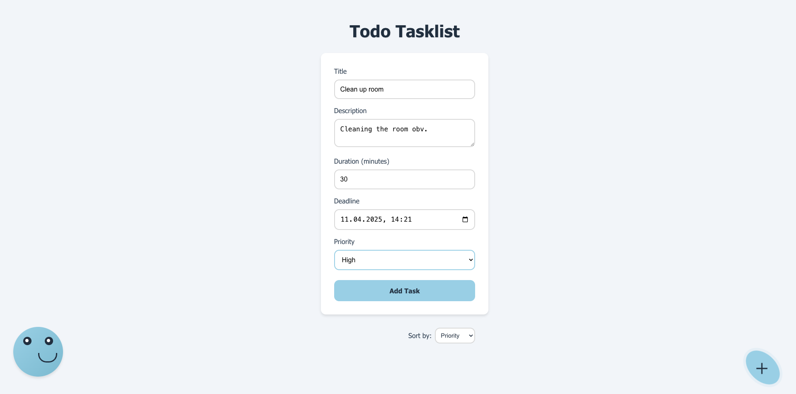
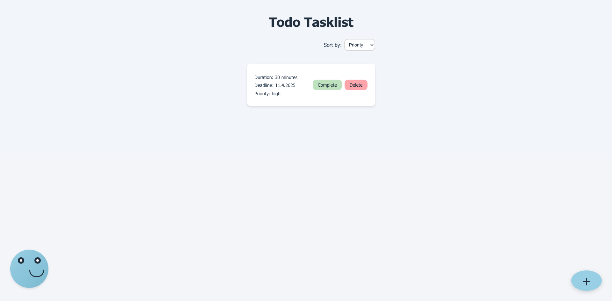
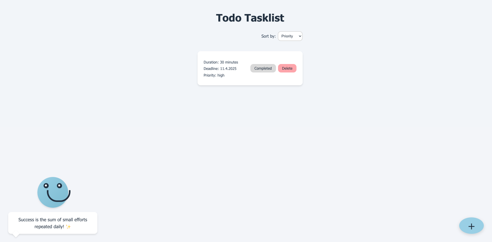

# Todo Task List Application

*Built entirely through AI-assisted development using Cursor*

A modern, user-friendly task management application built with React, TypeScript, and Vite.

## Features

- Add new tasks with descriptions
- View and manage existing tasks
- Motivational quotes to keep you inspired
- Clean and intuitive user interface

## Development with Cursor

This application was built using Cursor as an experiment to explore the capabilities of AI-assisted development. The development process included:

### Development Process
- Using AI to generate initial component structures and boilerplate code
- Implementing features with real-time code suggestions
- Writing tests with AI assistance to maintain high coverage
- Iterating on the UI with immediate feedback

### Technical Implementation
- TypeScript for type safety and better code organization
- React components for the user interface
- Vite for fast development and building
- Tailwind CSS for styling

## Screenshots

### Add Task


### View Tasks


### Motivational Quote


## Getting Started

### Prerequisites

- Node.js (v14 or higher)
- npm or yarn

### Installation

1. Clone the repository
2. Install dependencies:
   ```bash
   npm install
   ```
3. Start the development server:
   ```bash
   npm run dev
   ```

### Building for Production

```bash
npm run build
```

## Technologies Used

- React
- TypeScript
- Vite
- Tailwind CSS

## License

This project is licensed under the MIT License.
